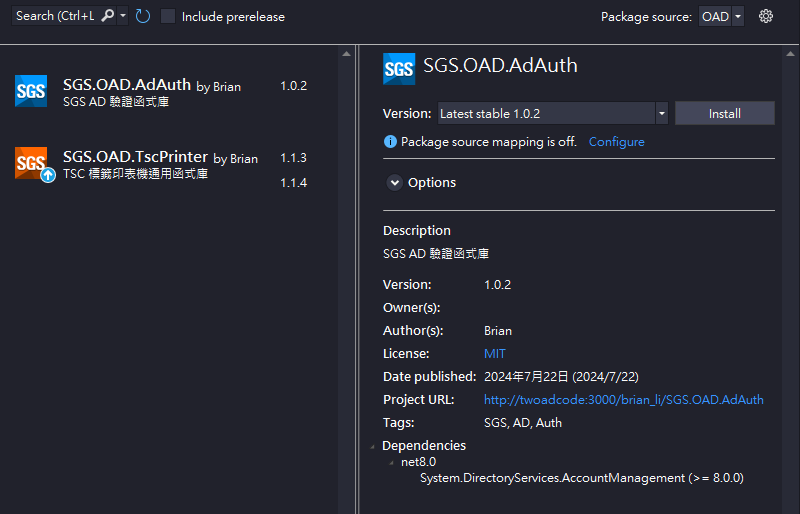
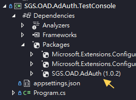

 
 


# 📦SGS.OAD.AdAuth

- SGS AD 驗證通用函式庫
- 提供帳號密碼驗證
- 帳號同步支援 email 形式
- 域名(Domain)預設 `APAC`，可更改
- 支援常用資料提取 (強型別回傳)
- 搭配測試專案，可預先測試套件安裝與執行

>⚠️專案導入 User Secrets，建議使用，減少資安風險

# ⚙️新增 NuGet 來源

目前套件暫放於 `\\twfs007\SGSSHARE\OAD\nuget\`

新增 NuGet 來源主要有兩種方式，可於 VS 內設定或加入組態檔

### 1. 於 Visual Stdio 加入

- Tools > Options > NuGet Package Manager > Package Sources > +
- 填寫 Name 與 Source

### 2. 加入 `nuget.config` (建議)

於方案(solution)根目錄新增組態檔 `nuget.config`

```sh
📁solution
    📄*.sln
    📄nuget.config #放在這裡
    📁.git
    📁project 1
    📁project 2
    ...
```

內容如下，請自行替換 `{source-name}` 與 `{source-path}`

```xml
<?xml version="1.0" encoding="utf-8"?>
<configuration>
  <packageSources>
    <add key="{source-name}" value="{source-path}" />
  </packageSources>
</configuration>
```

# 📥安裝 NuGet Package

## NuGet Package Manger

完成上述來源設定後，即可透過 NuGet Package Manger 搜尋自訂來源套件



## CLI

也可透過指令安裝

```powershell
Install-Package SGS.OAD.AdAuth
```

安裝完畢後，專案應該會長這樣



# ▶️使用套件

```cs
using SGS.OAD.AdAuth;

//使用帳號密碼，取得驗證結果(布林值)
bool valid = AdAuthHelper.IsValid(UserID, Password);

//取得使用者常用資訊，會先進行驗證，成功才會取出
AdInfoModel info = AdAuthHelper.GetInfo(UserID, Password);
```

## 🚨工號

- `2024-12-19` 台灣工號資料異常，有進行修改
- `2025-02-05` 移除工號相關修改，回歸 AD 驗證

HR 相關資訊，例如工號、部門、中文姓名等等，請改用套件 `SGS.OAD.HrInfo`

# 🧪使用測試專案

- 套件包含一個測試專案 `SGS.OAD.AdAuth.TestConsole`
- 測試專案 NuGet 來源參考 `SGS.OAD.AdAuth\bin\Debug`
- 建議使用 User Serets 減少機敏資料外洩

## 測試步驟

- 下載(clone)儲存庫，使用 visual studio 開啟
- `SGS.OAD.AdAuth` rebuild & pack，於 `bin\Debug` 產生套件檔 `*.nupkg`
- `SGS.OAD.AdAuth.TestConsole` Manage User Secrets，產生 `secret.json`
- `secret.json` 不會進入版控，避免資料外洩，請貼上以下內容並修改測試資料

```json
{
  "UserID": "測試AD帳號",   //需要修改
  "Password": "測試AD密碼", //需要修改
  "Domain": "APAC"
}
```

執行 `SGS.OAD.AdAuth.TestConsole` 應可進行測試，測試專案會優先抓取 `secret.json` 組態設定，這是較為安全的做法。如不習慣也可直接修改專案中的 `appsettings.json` (較不建議)

# 📝TODO

- 支援 DI
- 當域名錯誤或不存在時，嘗試縮短 LDAP 檢查時間
- 考慮導入 LOG
- Exception 處理
- 測試 .NET Framework 相容